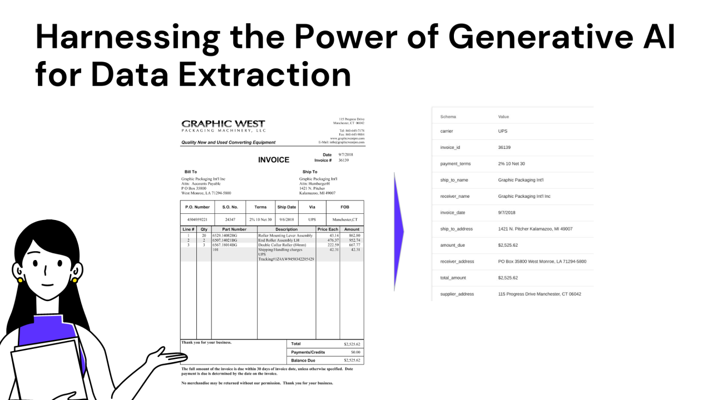

# 🩺 Zero-Shot Healthcare Medical Data Extraction with LLMs 🤖



## 📋 Overview 
This project focuses on developing a zero-shot medical data extraction system from doctor-patient conversations using cutting-edge Language Models (LLMs). By leveraging LangChain, Pydantic output parsing, and advanced prompt engineering techniques, the system delivers structured data that includes patient details, symptoms, medications, and even summaries. This tool aims to assist healthcare professionals by providing accurate and immediate information extraction from raw textual data.

## 🌟 Features 

- **Zero-Shot Extraction**: Automatically extracts relevant medical data without prior training on the specific dataset.
- **Conversational Context Understanding**: Identifies and processes conversation formats between doctors and patients.
- **Structured Output**: Generates structured data in JSON format, including patient details, symptoms, medications, and summaries.
- **Customizable Parsing**: Utilizes Pydantic models for flexible and accurate data parsing.
- **Prompt Engineering**: Sophisticated prompt templates guide the LLM in extracting precise information.

## 🛠️ Requirements

- Python 3.9+
- LangChain
- langchain_core
- langchain_openai
- Pydantic
- Pandas
- dotenv

Install the required packages using `pip`:

```bash
pip install langchain langchain_core langchain_openai pydantic pandas python-dotenv
```

## Setup 🚀

1. **Clone the Repository:**

    ```bash
    git clone https://github.com/yourusername/healthcare-data-extraction.git
    
    cd healthcare-data-extraction
    ```

2. **Environment Variables:**    
    Create a `.env.secret` file in the project root directory with your OpenAI API key:
    ```bash
   OPENAI_API_KEY=your_openai_api_key

3. **Prepare the Data:**    
    Ensure your input data is in the correct format. The system expects a JSON file (transcripts.json) containing the doctor-patient conversations.

</br>
Feel free to refer `Data_Extraction_Code.ipynb` file.
    
## 📝 Sample Inputs and Outputs 
**🔍 Sample Input 1 : (text format)**</br>
 During the visit, I examined Mr. Don Hicks, who is 81 years old and presented with a fungal infection. He had dischromic patches, nodal skin eruptions, and skin rash as symptoms. Upon examination, I confirmed the diagnosis of fungal infection. I advised Mr. Hicks to take precautions such as bathing twice a day, using detol or neem in the bathing water, keeping the infected area dry, and using clean cloths. I did not prescribe any medication for him.

***💡 Expected Output Structure:***</br>
{'is_conversation_format': False,</br>
  'name': 'Don Hicks',</br>
  'age': 81,</br>
  'condition': 'Fungal infection',</br>
  'symptoms': 'Dischromic patches, nodal skin eruptions, skin rash',</br>
  'precautions': 'Bathing twice a day, using detol or neem in the bathing water, keeping the infected area dry, using clean cloths',</br>
  'medications': nan,</br>
  'summary': 'Mr. Don Hicks, 81 years old, presented with a fungal infection showing symptoms of dischromic patches, nodal skin eruptions...',</br>
  'original_msg': 'During the visit, I examined Mr. Don Hicks, who is 81 years old and presented with a fungal infection. He had dischromic patches...'}
</br></br>

**🔍 Sample Input 2 :(Doctor Patient conversation)**</br>
D: Good morning, Amanda. How can I help you today?</br>P: Hi, Doctor. I've been feeling a lot of urine and it hurts when I pee. I also feel discomfort in my bladder.</br>D: I see. Based on your symptoms, it seems like you might have a urinary tract infection.</br>P: Yes, that's what I thought.</br>D: To help manage the symptoms, I would recommend that you drink plenty of water, increase your vitamin C intake, drink cranberry juice, and take probiotics. As for medication, I don't think it's necessary in this case.</br>P: Thank you, Doctor. I'll make sure to follow your advice. </br>D: You're welcome, Amanda. If the symptoms persist or worsen, please don't hesitate to come back for a follow-up appointment. Take care.

***💡 Expected Output Structure:***</br>
{'is_conversation_format': True, </br>
  'name': 'Amanda', </br>
  'age': -1,</br>
  'condition': 'Urinary tract infection',</br>
  'symptoms': 'Frequent urination, painful urination, discomfort in bladder',</br>
  'precautions': 'Drink plenty of water, increase vitamin C intake ...',</br>
  'medications': nan,</br>
  'summary': 'Patient Amanda is experiencing symptoms of a urinary tract infection. Doctor advised precautions such as ...',</br>
  'original_msg': "D: Good morning, Amanda. How can I help you today?\nP: Hi, Doctor. I've been feeling a lot of urine and it hurts when I ..."}

## 🙏 Acknowledgments 
- Inspired by various projects and tutorials on LangChain, Pydantic, and prompt engineering.

</br>
Feel free to connect if you have any questions or want to discuss the project further! 🌐
https://www.linkedin.com/in/nishant-mhatre/\Row number: 81\Row number: 59\Row number: 36